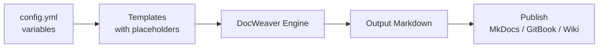

# 🧶 DocWeaver  
*A flexible documentation-template system for small teams and solo developers.*


---

## ✨ Overview
**DocWeaver** helps teams create consistent, high-quality documentation from reusable templates.  
It provides Markdown-based starter files, configurable variables, and lightweight automation to weave your docs into a coherent system—without complex toolchains.

> **Goal:** Empower non-technical contributors to produce developer-ready docs using familiar Markdown and YAML.

---

## 🧩 Key Features
- **Reusable Templates** – Quickly scaffold README, changelog, and guide structures.  
- **Configurable Variables** – Centralize product names, versions, and authors in one YAML file.  
- **Style Enforcement** – Built-in Markdown linting for headers, code blocks, and links.  
- **Publish-Ready Output** – Export to MkDocs or GitBook formats with one command.  
- **Extensible Design** – Add or modify templates to fit your workflow.

---

## 🚀 Quick Start
### 1. Install (mock example)
```bash
pip install docweaver
```

### 2. Initialize a new documentation set
```bash
docweaver init myproject
```

### 3. Preview the generated structure
```
myproject/
├── README.md
├── docs/
│   ├── getting-started.md
│   └── style-guide.md
└── config.yml
```

### 4. Customize your templates
Edit `config.yml` to update variables such as project name, author, and version.

---

## 📚 Documentation
| Section | Description |
|----------|-------------|
| [Overview](docs/overview/what-is-docweaver.md) | Conceptual intro and architecture |
| [Guides](docs/guides/getting-started.md) | Tutorials and workflows |
| [Reference](docs/reference/config-file.md) | YAML and CLI syntax |
| [Troubleshooting](docs/troubleshooting/faq.md) | FAQs and error resolution |
| [Contributing](docs/contributing/content-standards.md) | Content standards and PR workflow |

---

## 🧠 Philosophy
DocWeaver follows three core principles:
1. **Clarity over cleverness** – Documentation should explain, not impress.  
2. **Consistency through structure** – Uniform patterns improve discoverability.  
3. **Sustainability by design** – Reusable templates reduce maintenance load.

---

## 🧶 Documentation Generation Workflow



**Figure 1:** DocWeaver workflow from configuration to published documentation.

---

## 💡 Example Templates
See the [`examples/`](examples/) folder for:
- `sample-readme.md` – a generated README output  
- `template-example.md` – raw vs. woven Markdown  
- `sample-config.yml` – example project variables

---

## 🧰 Tech Stack (for realism)
- **Language:** Python 3.11+  
- **Docs:** Markdown + YAML  
- **Automation:** GitHub Actions (docs-lint workflow)

---

## 🧑‍💻 Contributing
We welcome improvements to templates, examples, and documentation.  
See [`CONTRIBUTING.md`](CONTRIBUTING.md) for content standards, pull-request workflow, and style conventions.

---

## 🕑 Version History
See the [CHANGELOG](CHANGELOG.md) for release notes.

---

## 🧾 About This Project

**DocWeaver** is a fictional yet fully realized documentation system created by **Julie Chandler** as part of a professional technical writing portfolio.  
It demonstrates best practices in:
- Information architecture  
- Technical documentation design  
- Version control with Git and GitHub  
- Automated documentation linting and CI/CD workflow setup  
- Visual communication through Markdown and Mermaid diagrams  

The project is intentionally lightweight, focusing on **clarity, structure, and maintainability**—the same principles that underpin effective documentation in real engineering environments.

> Visit [Julie Chandler’s GitHub profile](https://github.com/chandlerpm) to explore more projects and documentation samples.
---

## 📄 License
Licensed under the [MIT License](LICENSE).  
© 2025 DocWeaver Project – Created by Julie Chandler
