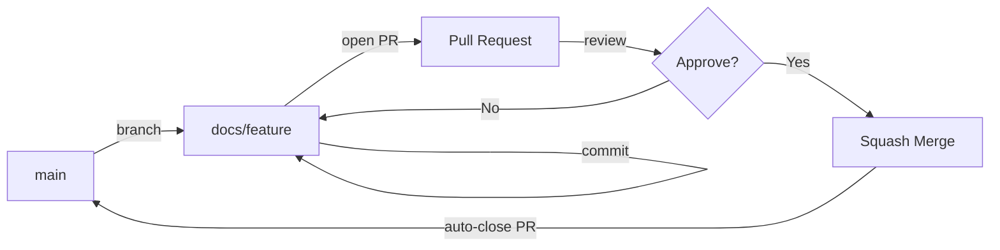

# Branching and Reviews

This guide defines a lightweight, professional workflow for branching, naming, and reviewing changes in **DocWeaver**. It is tuned for documentation-first repositories where clarity and maintainability matter more than velocity.

---

## 🔀 Branching Model

- **Default branch:** `main`
- **Short-lived topic branches** for changes:
  - `docs/<area>/<slug>`
  - `fix/<slug>`
  - `ci/<slug>`

**Examples**
- `docs/guides/add-style-guide-examples`
- `fix/typo-architecture-diagram-caption`
- `ci/tune-link-check-timeout`

### Visual Flow



---

## 🧾 Commit Message Convention

Use concise, **present-tense** summaries (~50 characters). Follow a simplified [Conventional Commits](https://www.conventionalcommits.org/) pattern for readability.

```
docs(guides): add examples section to getting-started
fix(readme): correct examples links
ci(lint): update markdownlint rules
```

**Body (optional):** wrap at ~100 characters and explain the *why* if not obvious.

---

## 🧠 Opening a Pull Request (PR)

**PR title:** mirror your main commit message, in imperative mood.

**Checklist**
- [ ] Links pass in CI (Docs Quality Check)
- [ ] Mermaid diagrams render on GitHub
- [ ] Headings follow sentence case
- [ ] Changelog updated (if user-visible)
  - Add an entry under the current `[Unreleased]` section or the next version.

**Scope policy**
- One logical change per PR (e.g., “Add Getting Started examples”)
- Larger changes may be split across multiple PRs

---

## 👀 Code Review Standards

### What reviewers look for
- **Clarity:** can a new reader follow the page without external context?  
- **Consistency:** matches our [content standards](content-standards.md)  
- **Accuracy:** links valid, examples current, syntax correct  
- **Structure:** headings, figures, and tables follow conventions  

### Review Levels
- 💬 *Comment*: suggestion or clarification  
- 🔄 *Request changes*: must-fix issues (broken links, inconsistent terminology, missing alt text)  
- ✅ *Approve*: ready to squash-merge

---

## 🔄 Merge Strategy

- Always use **Squash and merge** for a clean linear history.
- The final squash commit message should summarize the entire change set clearly:

```
docs(overview): add repo architecture diagram and tighten copy
```

---

## 🌿 Branch Lifecycle

- Delete merged branches after merge (via GitHub UI).  
- Rebase or recreate long-lived branches to avoid drift.  
- Stale branches older than a few weeks should be closed unless still active.

---

## 🧩 Quick Recipe

```bash
# 1. Create a topic branch
git switch -c docs/guides/add-examples

# 2. Make changes in VS Code, commit in small chunks
git add .
git commit -m "docs(guides): add examples to getting-started"

# 3. Push branch to origin
git push -u origin docs/guides/add-examples

# 4. Open a PR on GitHub and complete the checklist

# 5. Address feedback, then squash and merge

# 6. Delete the branch and update CHANGELOG if needed
```

---

## 🏁 Summary

| Step | Action | Outcome |
|------|--------|---------|
| 1 | Create branch from `main` | Isolate work |
| 2 | Write commits with clear messages | History remains readable |
| 3 | Open PR, request review | Shared visibility |
| 4 | Reviewer approves | Merge via **Squash and Merge** |
| 5 | Update changelog if applicable | Documented release trail |
| 6 | Delete branch | Clean repo |

---

> Following this branching and review model keeps DocWeaver’s documentation history concise, comprehensible, and professional—demonstrating the same editorial discipline you’d apply in a production documentation environment.

---
_See also: [Changelog Guidelines](changelog-guidelines.md)_