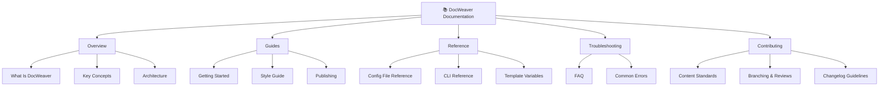

# DocWeaver Documentation

Welcome! **DocWeaver** helps teams create consistent, high-quality documentation from reusable templates.

---

## 🗺️ Documentation Architecture

**Figure 2:** DocWeaver documentation hierarchy and cross-references.

---

## Who This Is For
- Solo developers or small teams who want consistent Markdown documentation.  
- Non-technical contributors who need a clear structure to follow.  

---

## What You’ll Find
- **Guides** for first success  
- **Reference** materials for YAML and CLI usage  
- **Troubleshooting** resources for common issues  
- **Contributing** standards for content and workflow  

> If you’re new, start with **[Getting Started](guides/getting-started.md)**.
