# Key Concepts

This page introduces the core ideas behind **DocWeaver**—its philosophy, document model, and how the parts of the system work together to produce clear, consistent documentation.

---

## 🧭 Overview

DocWeaver is designed around three simple principles:

1. **Clarity over cleverness** — Documentation should explain, not impress.  
2. **Consistency through structure** — Predictable layouts make content easier to find and maintain.  
3. **Sustainability by design** — Reusable templates and shared variables reduce maintenance effort.

The result is a system that helps small teams or solo writers build documentation that looks professional and behaves predictably, without depending on a heavy framework.

---

## 🧱 Core Building Blocks

| Concept | Description |
|----------|-------------|
| **Template** | A reusable Markdown structure that defines headings, sections, and placeholders. |
| **Variable** | A key/value pair in `config.yml` used to substitute project details into templates. |
| **Weaving** | The process of combining templates and variables to generate finalized Markdown. |
| **Docs Hierarchy** | A logical folder structure (`overview`, `guides`, `reference`, etc.) that groups content by purpose. |
| **CI Workflow** | A GitHub Action that checks for valid links, consistent Markdown syntax, and rendering issues. |

---

## 🔄 Documentation Lifecycle

The lifecycle of a DocWeaver page follows a repeatable pattern:

```mermaid
flowchart TD
    A[Plan topic] --> B[Select or create template]
    B --> C[Add variables in config.yml]
    C --> D[Render Markdown page]
    D --> E[Commit and push]
    E --> F[Docs Quality Check]
    F -->|✅ Pass| G[Publish via Pages]
    F -->|❌ Fix errors| B
```



**Figure 1:** The standard lifecycle of a DocWeaver documentation page.

---

## 🧩 Information Architecture

DocWeaver’s folder structure organizes content by **reader intent** rather than writer ownership:

```
docs/
├── overview/
│   ├── what-is-docweaver.md
│   ├── key-concepts.md
│   └── architecture.md
├── guides/
│   ├── getting-started.md
│   ├── writing-with-templates.md
│   └── publishing.md
├── reference/
│   └── config-file.md
├── troubleshooting/
│   └── faq.md
└── contributing/
    ├── content-standards.md
    ├── branching-and-reviews.md
    └── changelog-guidelines.md
```

Each folder contains files that serve a clear purpose:

- **Overview:** conceptual material and system architecture  
- **Guides:** task-oriented, step-by-step instructions  
- **Reference:** YAML and CLI syntax, configuration details  
- **Troubleshooting:** common questions and errors  
- **Contributing:** standards for collaboration and versioning

---

## 🧠 Conceptual Model

DocWeaver treats documentation as a **woven fabric**—individual threads (templates, variables, and workflows) combine to form a unified result.


- **Templates** define structure.  
- **Variables** personalize content.  
- **Weaving** compiles both into final Markdown.  
- **Output** can be read locally or deployed to Pages, MkDocs, or GitBook.

---

## 🧰 Tooling at a Glance

| Tool | Purpose | Example Use |
|------|----------|-------------|
| **VS Code** | Author and preview Markdown | Write and commit docs locally |
| **Git + GitHub** | Version control and CI | Push updates, trigger lint checks |
| **Markdownlint** | Enforce syntax rules | Check headings, spacing, code fences |
| **Markdown-link-check** | Validate internal/external links | Prevent broken references |
| **Mermaid** | Generate diagrams inline | Show workflows and hierarchies |
| **GitHub Pages / MkDocs** | Publish docs | Host live portfolio site |

---

## 🧾 Example Concept Flow

| Stage | Input | Output | Example |
|--------|--------|---------|---------|
| Template | Markdown scaffold | Placeholder file | `examples/template-example.md` |
| Variable | YAML key/value | Contextual data | `config.yml` |
| Render | Combined file | Finalized Markdown | `docs/guides/generated.md` |
| CI | Workflow job | Validation results | “Docs Quality Check” badge |
| Publish | Pages / MkDocs | Public site | `https://chandlerpm.github.io/docweaver/` |

---

## 💡 Key Takeaways

- Templates = **structure**  
- Variables = **content**  
- Workflows = **consistency**  
- Documentation = **a system, not an afterthought**

DocWeaver models the same rigor expected in software engineering—modular, reusable, reviewed, and versioned.

---

> Understanding these key concepts ensures that every new contributor can extend or adapt DocWeaver without breaking its clarity, structure, or maintainability.

---
_See also: [Architecture](architecture.md)_
