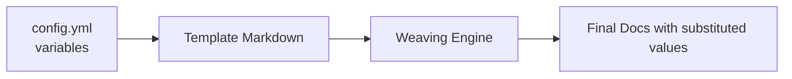

# Template Variables

This page documents how **DocWeaver** handles template variables—named placeholders that make your Markdown pages dynamic, reusable, and consistent.  
Variables are defined once in `config.yml` and automatically substituted when templates are rendered or manually edited.

---

## 🧩 What Are Template Variables?

Template variables are **tokens** enclosed in double curly braces (`{{ }}`) inside Markdown files.

Example:

```
# {{ project_name }}

Version: {{ version }}
Last updated: {{ last_updated }}
```

When processed through the variable system, placeholders are replaced with actual values from `config.yml`.

**Rendered output:**

```
# DocWeaver

Version: 0.3.0  
Last updated: 2025-11-02
```

---

## ⚙️ Defining Variables in `config.yml`

The root `config.yml` file acts as a central registry for reusable terms and metadata.

```yaml
# config.yml
project_name: DocWeaver
version: 0.3.0
author: Julie Chandler
last_updated: 2025-11-02
description: >
  A flexible documentation template system for small teams and solo developers.

contact:
  email: chandlerpm@protonmail.com
  github: https://github.com/chandlerpm
```

You can define:
- **Strings** — simple key/value pairs  
- **Multiline text** — use `>` or `|` for paragraphs  
- **Nested objects** — define structured data like contact info

---

## 🧱 Using Variables in Markdown

Insert variables anywhere in your templates using the `{{ variable_name }}` syntax.

Example:

```
# {{ project_name }}

Maintained by: [{{ author }}]({{ contact.github }})
```

When rendered, this becomes:

```
# DocWeaver

Maintained by: [Julie Chandler](https://github.com/chandlerpm)
```

---

## 🪄 Variable Scoping and Nesting

DocWeaver supports **nested keys** to keep configuration organized.

Given this `config.yml`:

```yaml
project:
  name: DocWeaver
  version: 0.3.0
metadata:
  author: Julie Chandler
  updated: 2025-11-02
```

You can access nested values using dot notation:

```
# {{ project.name }} Documentation
Version: {{ project.version }}
Author: {{ metadata.author }}
```

---

## 🧮 Example Template

**Template (`examples/template-example.md`):**

```
# {{ project.name }} — {{ page_title }}

_Updated: {{ metadata.updated }}_

## Overview
{{ description }}

## Steps
1. {{ step_one }}
2. {{ step_two }}
```

**Variables (`config.yml`):**

```yaml
project:
  name: DocWeaver
page_title: Writing with Templates
metadata:
  updated: 2025-11-02
description: Demonstrate how DocWeaver replaces template variables.
step_one: Define variables in config.yml
step_two: Insert them in Markdown using {{ variable_name }}
```

**Rendered Output:**

```
# DocWeaver — Writing with Templates

_Updated: 2025-11-02_

## Overview
Demonstrate how DocWeaver replaces template variables.

## Steps
1. Define variables in config.yml
2. Insert them in Markdown using {{ variable_name }}
```

---

## 🧰 Common Variable Categories

| Category | Key Example | Purpose |
|-----------|--------------|----------|
| **Project Info** | `project_name`, `version`, `author` | Metadata for titles, headers, and READMEs |
| **Dates** | `last_updated`, `release_date` | Keep timestamps current |
| **Navigation** | `base_url`, `docs_path` | Generate relative links |
| **Content Snippets** | `contact_info`, `footer_note` | Reuse text fragments across pages |
| **Formatting** | `em_dash`, `arrow` | Define special symbols for consistency |

---

## 🔧 Troubleshooting Variable Substitution

| Issue | Cause | Solution |
|--------|--------|-----------|
| `{{ variable_name }}` still visible | Key missing in `config.yml` | Add the variable or correct its name |
| Incorrect value inserted | Key mismatch or indentation error | Check YAML indentation and hierarchy |
| YAML error | Tabs or unescaped characters | Use spaces and quote strings with `:` or `#` |
| Extra curly braces in output | Regex not applied or malformed template | Ensure variable pattern matches `{{ key }}` exactly |

---

## 🧠 Tips for Clean Templates

- Keep variable names **short and descriptive** (`project_name`, not `the_name_of_the_project`)  
- Group related variables in YAML sections (`project:`, `metadata:`)  
- Avoid redefining global variables inside multiple files  
- Add comments to `config.yml` for clarity  
- Track variable additions or deletions in the changelog  

---

## 🧵 Example: Variable System Diagram



**Figure 1:** The DocWeaver variable substitution flow.

---

## ✅ Best Practices Summary

| Goal | Recommendation |
|------|----------------|
| Reuse values | Store once in `config.yml` |
| Keep consistent | Follow one naming style (snake_case) |
| Avoid duplication | Use shared variables for common phrases |
| Track updates | Commit variable changes with meaningful messages |
| Verify results | Run the Docs Quality Check after updates |

---

> Template variables make your documentation modular, scalable, and self-consistent—treat them as your single source of truth across every Markdown file.

---

_See also: [Config File Reference](config-file.md)_