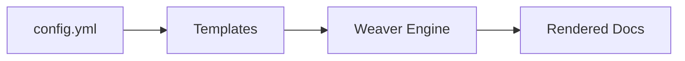

# Style Guide

The **DocWeaver Style Guide** defines editorial, structural, and formatting conventions for all documentation within this repository.  
Its goal is to ensure every page reads clearly, looks consistent, and aligns with modern technical-writing best practices.

---

## ✍️ Writing Philosophy

DocWeaver favors **clarity over cleverness** and **consistency over customization**.  
Writers should focus on accuracy, precision, and empathy for the reader.

| Principle | Meaning |
|------------|--------|
| **Clarity** | Explain concepts simply; avoid jargon and filler. |
| **Consistency** | Reuse headings, phrasing, and patterns across pages. |
| **Accessibility** | Use descriptive link text and alt text for diagrams. |
| **Neutral Tone** | Professional, direct; avoid marketing language. |

---

## 🧩 Page Structure

Each Markdown page follows this pattern:

```
# Title (H1)

Short summary paragraph (one or two lines).

---

## Section Heading (H2)
Content...

### Subsection (H3)
Details...
```

**Rules**
- One **H1** (`#`) per page.  
- Use **H2s** for main sections, **H3s** for subtopics.  
- Do not skip heading levels.  
- End each file with a newline (no trailing spaces).

---

## 📚 Document Types

| Type | Purpose | Example |
|------|---------|---------|
| **Overview** | Conceptual introductions | `docs/overview/what-is-docweaver.md` |
| **Guide** | Step-by-step tasks | `docs/guides/writing-with-templates.md` |
| **Reference** | Definitions for config, commands, or APIs | `docs/reference/config-file.md` |
| **Troubleshooting** | FAQs and common issues | `docs/troubleshooting/common-errors.md` |
| **Contributing** | Collaboration standards and workflows | `docs/contributing/content-standards.md` |

---

## 🧱 Language and Grammar

| Element | Rule | Example |
|--------|------|---------|
| **Voice** | Prefer active voice | ✅ “Run the script.” / ❌ “The script should be run.” |
| **Tense** | Present for steps; past for results | “Save the file. The workflow runs automatically.” |
| **Tone** | Direct and instructive | “Open VS Code,” not “You should open VS Code.” |
| **Articles** | Drop “the” before filenames/buttons | “Run `mkdocs build`,” not “Run the `mkdocs build`.” |
| **Capitalization** | Sentence case for headings | `# Writing with templates` |
| **Punctuation** | Use the Oxford comma | “templates, guides, and reference files” |
| **Acronyms** | Spell out on first use | “Continuous Integration (CI)” |

---

## 🔤 Formatting Rules

| Element | Rule | Example |
|--------|------|---------|
| **Inline code** | Backticks around filenames, keys, CLI | `config.yml`, `git push` |
| **Code blocks** | Fenced blocks with language | ```bash``` / ```yaml``` |
| **Notes** | Blockquotes for asides | `> Note: …` |
| **Lists** | `1.` for ordered; `-` for unordered | `1. Step one` |
| **Links** | Use relative paths within docs | `[config file](../reference/config-file.md)` |
| **Emphasis** | **Bold** sparingly; *italics* for terms | “**Docs Quality Check** runs on push.” |
| **Figures** | Caption as “**Figure X:** …” below the figure | See Mermaid example |

---

## 🎨 Visual and Diagram Standards

### Mermaid Diagrams
Use Mermaid for workflows, hierarchies, and architecture.

**Example**
```markdown

**Figure 1:** DocWeaver rendering workflow.
```

**Guidelines**
- Keep diagrams simple (≈ 4–6 nodes).  
- Use left-to-right (`LR`) for processes; top-down (`TD`) for hierarchies.  
- Provide a short caption below every diagram.  
- Avoid inline styling/color overrides.

---

## 📏 Line and Paragraph Rules

| Rule | Limit | Rationale |
|------|------|-----------|
| **Line length** | ~100 characters | Improves readability in diffs |
| **Paragraph length** | 3–4 lines | Easier to scan |
| **Code fence width** | ≤ 100 chars | Prevents horizontal scrolling on GitHub |

Wrap manually if a line exceeds ~100 characters.

---

## 🧾 File Naming and Paths

| Type | Format | Example |
|-----|--------|---------|
| **Markdown pages** | lowercase-hyphenated | `writing-with-templates.md` |
| **Images/assets** | lowercase-hyphenated | `workflow-diagram.png` |
| **Folders** | lowercase | `guides`, `reference` |

Avoid spaces or underscores in names.

---

## 🧰 Git and CI Conventions

- Commits follow **Conventional Commits** style:
  ```
  docs(guides): add publishing instructions
  fix(reference): correct YAML example blocks
  ci(lint): relax MD013 line-length rule
  ```
- Prefer **Squash and merge** for PRs.  
- Ensure **Docs Quality Check** passes before merging.  
- Update `CHANGELOG.md` for user-visible changes (Added/Changed/Fixed).

---

## 🧠 Accessibility and Readability

- Provide descriptive alt text for diagrams and screenshots.  
- Avoid relying on color alone to convey meaning.  
- Use clear, descriptive link text rather than bare URLs.  
- Prefer tables for structured comparisons; keep them narrow.

---

## 🧾 Example Page Template

```
# Title

Short introductory paragraph.

---

## Overview
Explain what this page covers and why it matters.

## Steps
1. Do the first thing.
2. Do the second thing.

## References
- [Related guide](../guides/writing-with-templates.md)
```

---

## ✅ Quick Reference Summary

| Category | Rule | Example |
|---------|------|--------|
| Heading style | Sentence case | `## Writing with templates` |
| File naming | Hyphenated lowercase | `config-file.md` |
| Voice | Active, direct | “Edit the file.” |
| Links | Relative | `[config file](../reference/config-file.md)` |
| Lists | Parallel structure | “1. Run command. 2. Verify output.” |
| Figures | Captioned | `**Figure 1:** Overview diagram` |

---

> Consistent style builds trust. DocWeaver’s tone and format demonstrate clarity, discipline, and attention to detail—the same qualities that define excellent documentation.

---

_See also: [Content Standards](../contributing/content-standards.md)_